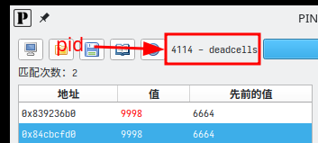
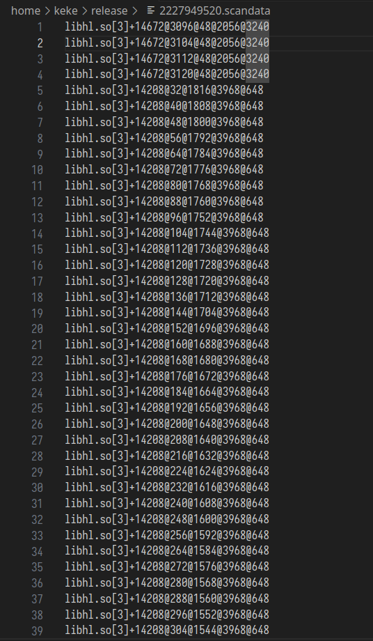
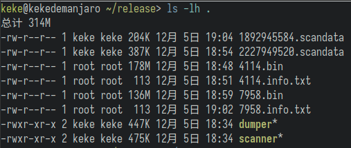

([中文](./zh.md) / [English](./en.md))

Tutorial for PointerSearch-X

What is the use of pointer chain scanning?

> PointerSearch concept:
> ASLR causes the program memory address to always be different when you start the program. The so-called "static" addresses are > > addresses relative to the beginning of the program code (BinaryFile). With a static address, once you find it, you're done, because the address of the loader (BinaryFile) is easy to find. Unfortunately, not all memory of interest are "static", for these either code hack(often referred to as ASM hack) is needed or a pointer chain is needed(to find this chain is often referred to as pointer search).
> Pointer search is usually used to automatically find more complex pointer chains. For very simple pointer chains, only a debugger is needed to find them. Of course, pointer searches are often also useful in scenarios where a debugger cannot be used.

Imagine a game is too difficult and you want to cheat. Each time before you start the game, you need to spend a few minutes performing a memory scan to find the address of the data;

If the data you need is hidden, such as the coordinates of the character in the game, you may need more time to find it. Before that, you need to ask the enemy "please don't attack me".

But with a pointer chain, you can find the address of the data in 0.1 seconds, and you can even share it with others (as long as the game version is the same).

Before this, you need to know whether the target program is running in 64-bit mode or 32-bit mode. PointerSearch-X currently only supports scanning 64-bit native applications.

First, you need to know the target address and process pid, I recommend using [PINCE](https://github.com/korcankaraokcu/PINCE).



Then run the command `sudo ./dumper disk --pid 4114` to dump the process memory.


it will create two files `*.bin` and `*.info.txt`.

Next, open `*.info.txt` with a text editor. This records some modules that can be used as base addresses, which will guide subsequent pointer chain scanning behavior.


unnecessary modules, such as libc.so.6 libX11-xcb.so, etc. They are system libraries, and game data will never be in them, so we delete these lines. Excluding useless modules can speed up scanning.

*Do not leave blank lines in the file

In the end, I only kept these


run scanning program

`./scanner scan --bin 4114.bin --info 4114.info.txt -l 0x84cbcfd0 -d 4 -r 0:4000`

`--bin` specifies the dumped *.bin file.

`--info` specifies our modified *.info.txt file.

`-l/--list` multiple target addresses can be specified, separated by `-`.

`-d/--depth` represents the maximum depth of the pointer chain, maximum support `2^64`.

`-r/--range` represents the offset range. It can support up to -2^64:+2^64.

Note that `-d/--depth` and `-r/--range` will greatly affect the scanning speed and the results produced.

The scanning cost is O(NN*D) (D: maximum depth, N: number of range). In general, the larger the number set, the slower the scan, and the more results.

After the scan is completed, it will produce a `*.scandata` file.


There will be many pointer chains in it, but they cannot guarantee that they are all valid.



restart the target process, and then re-find the target address->dump->scan.

Now we have these files.



Execute command `scanner diff --f1 1892945584.scandata --f2 2227949520.scandata --out coin.txt`

It will store the pointer chains that exist stably in the two scans into the `coin.txt` file.


We randomly find one to verify if it can be used.

Execute the command `sudo ./dumper test --pid 9325 --chain "libhl.so[3]+14208@1176@2280@48@648"`

Successfully obtained the address of the coin `0x70d7e298`

Subsequently, I restarted the target process twice, and you can see that the dynamically changing coin address can be accurately obtained.


Then we can copy this address to [PINCE](https://github.com/korcankaraokcu/PINCE) to modify it.


# TL;DR

While writing this tutorial I forgot which version of the game I had.

If you want to give it a try you can try `Linux x86_64 DeadCells v34 [2023-06-20 - ffcb38d13 - 15 - Steam]`

Set `depth/d` 6 `range/r` 0:900

> In game coin data: verify pointer chain `libhl.so[3]+14208@488@888@192@232@136@72`


Other game: `Android arm64-v8a 9you-SoulKnight 5.4.7.9`

Set `depth/d` 4 `range/r` 0:3000

> In game coin data: verify pointer chain `libil2cpp.so[3]+7806384@184@576@32`

## FAQ

`*.scandata` convert PINCE `*.pct` cheat table.

```shell
./conv pince --scandata file.scandata
```

